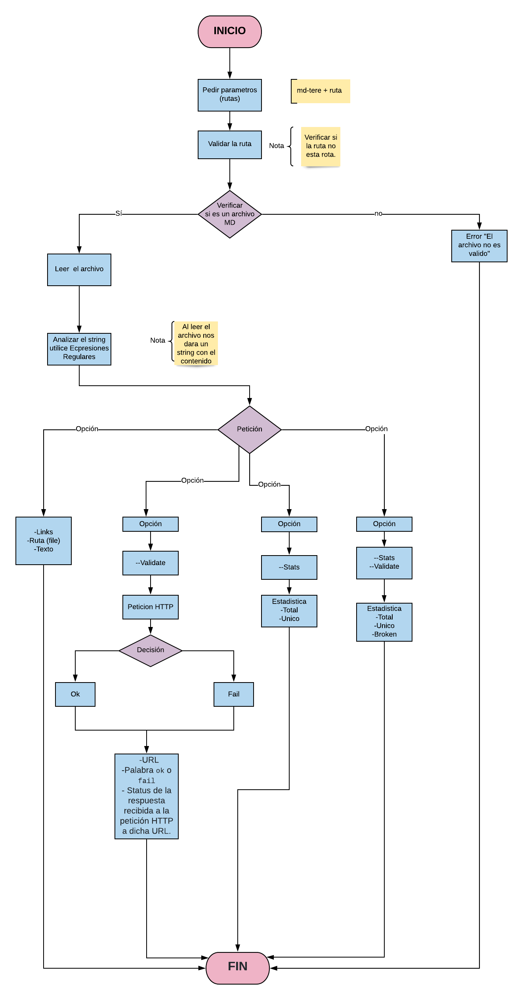

# Markdown Links: MD-TERE

## 1. Preámbulo

[Markdown](https://es.wikipedia.org/wiki/Markdown) es un lenguaje de marcado
ligero muy popular entre developers. Es usado en muchísimas plataformas que
manejan texto plano (GitHub, foros, blogs, ...), y es muy común
encontrar varios archivos en ese formato en cualquier tipo de repositorio
(empezando por el tradicional `README.md`).

Estos archivos `Markdown` normalmente contienen _links_ (vínculos/ligas) que
muchas veces están rotos o ya no son válidos y eso perjudica mucho el valor de
la información que se quiere compartir.

Dentro de una comunidad de código abierto, nos han propuesto crear una
herramienta usando [Node.js](https://nodejs.org/), que lea y analice archivos
en formato `Markdown`, para verificar los links que contengan y reportar
algunas estadísticas.

## 2. Resumen del proyecto

[Node.js](https://nodejs.org/es/) es un entorno de ejecución para JavaScript
construido con el [motor de JavaScript V8 de Chrome](https://developers.google.com/v8/).
Esto nos va a permitir ejecutar JavaScript en el entorno del sistema operativo,
ya sea tu máquina o un servidor, lo cual nos abre las puertas para poder
interactuar con el sistema en sí, archivos, redes, ...

En este proyecto nos alejamos un poco del navegador para construir un programa
que se ejecute usando Node.js, donde aprenderemos sobre cómo interactuar con el
sistema archivos, con el entorno (_proceso_, _env_, _stdin/stdout/stderr_), ...

## 3. Objetivos de aprendizaje

El objetivo práctico de este proyecto es que aprendas cómo crear tu propia
**librería** (o biblioteca - _library_) en JavaScript.

Diseñar tu propia librería es una experiencia fundamental para cualquier
desarrollador porque que te obliga a pensar en la interfaz (API) de tus
_módulos_ y cómo será usado por otros developers. Debes tener especial
consideración en peculiaridades del lenguaje, convenciones y buenas prácticas.

## 4. ¿Qué es  md-tere?
Es una librería que te permite identificar los links de un archivo `Markdown`, verlos enlistados en tu consola. Cada  link y contiene las siguientes propiedades:
* `href `: URL encontrada.
* `text`: Texto que aparecía dentro del link (<a>).
* `file`: Ruta del archivo donde se encontró el link. 

## 5. Instalación 
Deberás tener instalado  [Node.js](https://nodejs.org/) y por lo tanto npm. Dirígite a tu terminal, posicionate en la carpeta que deseas utilizar  y coloca el siguiente comando: 
nmp install md-tere 
o lo puedes hacer de manera global con npm install -g md-tere.

## 6. Forma de uso
Una vez instalado puedes colocarte en la carpeta y colocar en la terminal :  md-tere < ruta del archivo > y enter. 
Ejemplo: md-tere README.md

## 7. Plan de acción 

## Tareas a realizar 

### Validar ruta
- [x] Verificar si la ruta no esta rota
- [x] Si es correcta continuar con el proceso
- [x] Si esta rota mostrar error (La ruta no es valida)

### Verificar si la ruta es un archivo MD
- [x] Si es correcta continuar con el proceso
- [x] Si no es un MD mostra erro (Archivo no valido)

### Leer el archivo
- [x] Usar readFileSync para leer el archivo

### Si no, nos pide alguna opcion 
- [x] Mostrar los links
- [x] Ruta
- [x] Texto 

### Si solicita la opcion --Validate
- [ ] Hacer la peticion HTTP
- [ ] Mostrar ok
- [ ] Mostrar Fail

### Si solicita la opcion --Stats
- [ ] Mostrar estadisticas
- [ ] Total
- [ ] Unico

### Si solicita la opción --Validate --States
- [ ] Mostrar estadisticas
- [ ] Total
- [ ] Unico
- [ ] Broken

# Diagrama de flujo

